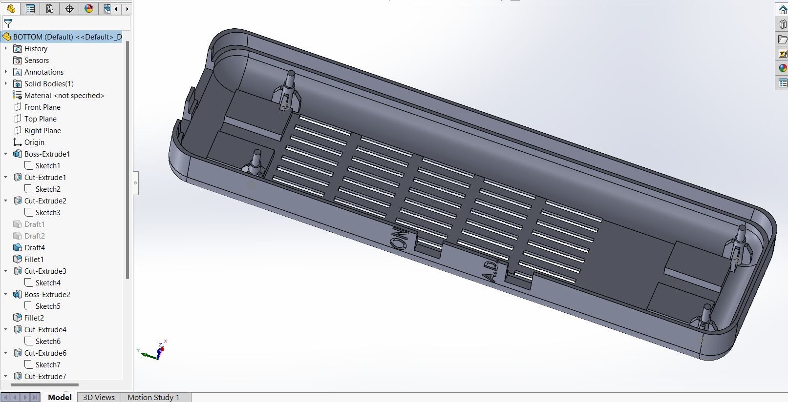
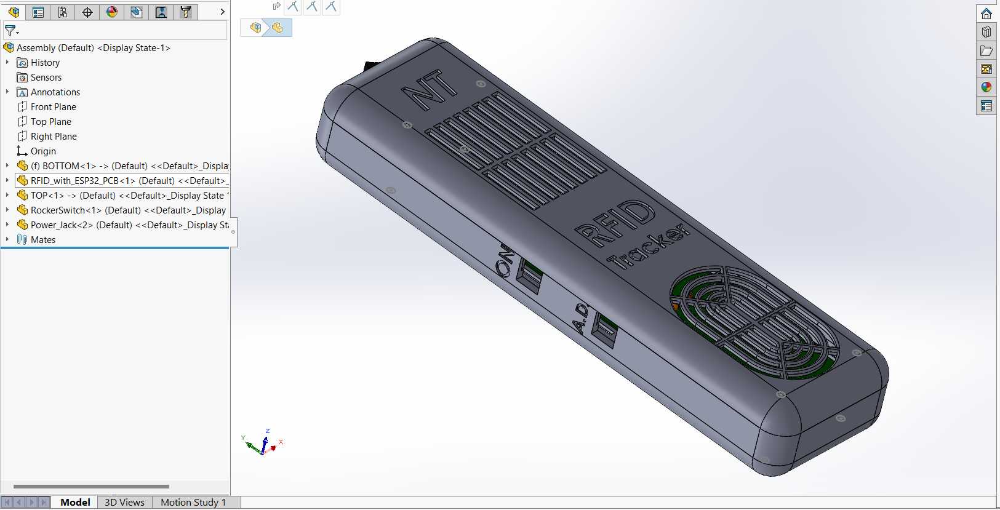
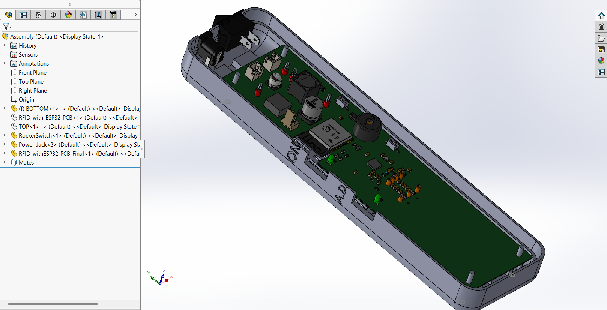
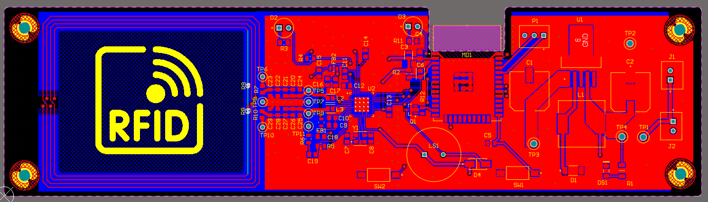
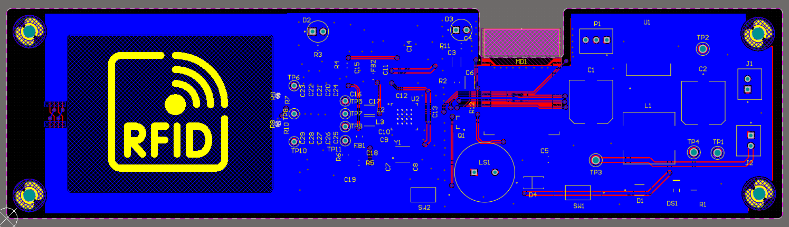
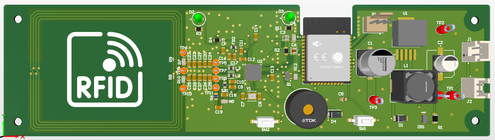
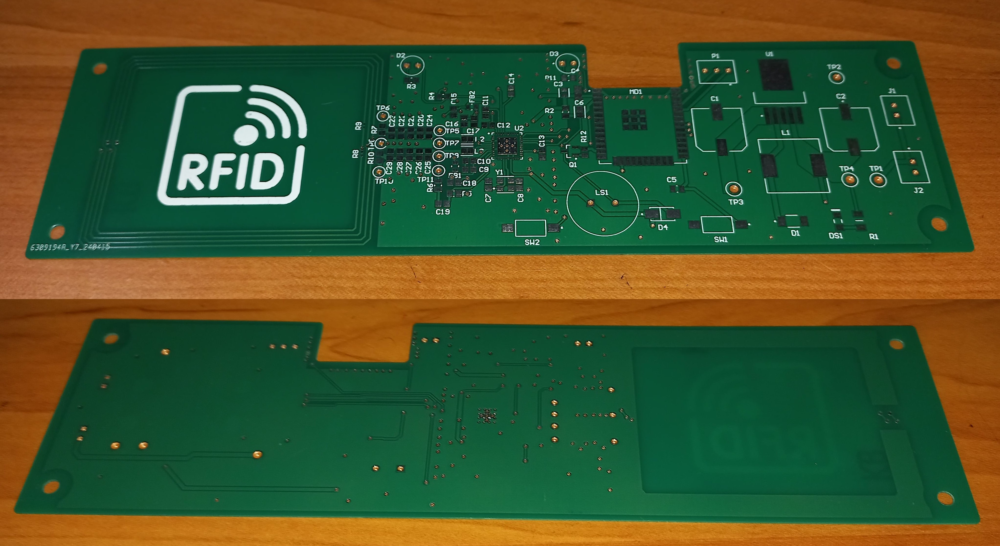
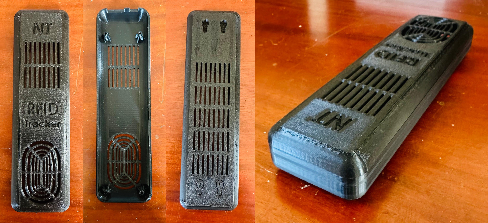
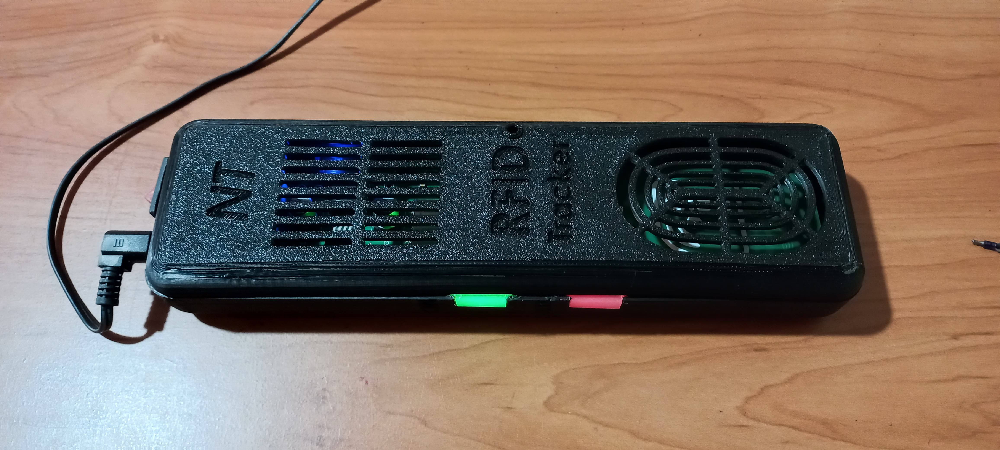

### RFID-Based Asset Tracking Device for Forklifts

#### Overview:

This project aims to develop an RFID-based asset tracking device for forklifts, enhancing asset management efficiency in warehouse environments. The device utilizes RFID technology for asset identification and tracking, integrating with existing forklift systems to provide real-time visibility of asset movements. The system consists of an RFID reader mounted on the forklift, antennas for RFID signal transmission and reception, and a cloud-based platform for data storage and analysis.

#### Features:

*   **RFID Technology:** Utilizes HF RFID technology (13.56MHz) for asset tracking, ensuring reliable and accurate identification.
*   **Real-Time Tracking:** Provides real-time visibility of asset movements, enabling efficient inventory management and asset utilization.
*   **Cloud Connectivity:** Integrates with cloud-based platforms for data storage, analysis, and remote access.
*   **User Interface:** Includes LEDs and a buzzer for user feedback, indicating successful RFID reads and system status.
*   **Low Power Consumption:** Designed for low power consumption, ensuring long-term operation without frequent recharging or replacement of batteries.

#### Components:

*   **PN532 RFID Reader:** Interfaces with RFID tags to read and write data, enabling asset tracking functionality.
*   **ESP32 WROOM 32:** Provides WiFi connectivity for data transmission to cloud servers, enabling real-time tracking updates.
*   **LM2596S-3.3 Voltage Regulator:** Converts the 12V forklift battery voltage to 3.3V for powering the ESP32 and PN532.
*   **Antenna and Matching Circuit:** Enables efficient transmission and reception of RFID signals, ensuring reliable asset tracking.

#### Installation:

1.  **Mounting:** Attach the RFID reader and antennas to the forklift as per the installation instructions.
2.  **Power Supply:** Connect the device to the forklift battery using the provided power cable.
3.  **Network Connection:** Configure the device to connect to the WiFi network in the warehouse.
4.  **Software Setup:** Install the necessary software on the forklift's onboard computer to receive and process RFID data.

#### Usage:

1.  **Asset Tagging:** Attach RFID tags to assets to be tracked, ensuring they are within the reader's range.
2.  **Asset Tracking:** Drive the forklift as usual, and the RFID reader will automatically scan nearby assets and update their locations in real-time.
3.  **Data Analysis:** Use the cloud-based platform to analyze asset movements, optimize inventory placement, and improve overall warehouse efficiency.

#### Maintenance:

*   **Regular Inspections:** Periodically check the device for any physical damage or loose connections.
*   **Software Updates:** Keep the device's software up to date to ensure optimal performance and compatibility with the cloud platform.
*   **Battery Replacement:** Replace the forklift battery as needed to maintain continuous power supply to the device.

#### For More Details:

For a more detailed description of the project, including design specifications, circuit diagrams, and enclosure designs, please refer to the project's design document.

#### Achieving recognition as one of the top 3 projects in the module highlights my ability to deliver high-quality solutions that meet both technical and practical challenges. This accomplishment reflects my commitment to innovation, precision, and impactful engineering design.

* * *

#### Enclosure Design:

#### PCB Design:

#### Printed PCB:

#### Enclosure:

#### Prototype:

